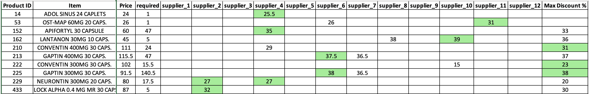

# 💊 Best Discount Detection Automation

This project automates the **daily detection of the best supplier discount** for pharmaceutical products by cross-referencing a demand list with multiple supplier files.

Only products that appear in **both the demand file and supplier files** are included in the analysis. The final report consolidates all available offers per product, compares them with historical pricing data, and highlights the current best deal.

This allows purchasing teams to make fast, data-driven decisions by comparing current supplier offers against historical trends and ensuring optimal procurement pricing.

---

## 📌 Features

- 🗂️ Filters and processes only the **relevant products** (present in both demand and supplier files)
- 📊 Merges current supplier offers with **historical discounts**
- 🔍 Identifies and **highlights the best available discount** for each product
- 📤 Exports a fully formatted Excel report with:
  - All supplier discounts per product
  - Historical maximum discount
  - Highlighted best discount (current)

---
## ✅ Dependencies

- pandas
- numpy
- openpyxl
- xlsxwriter
## 🛠️ How It Works

1. **Inputs:**
   - `demand_file.xlsx` — List of required pharmaceutical products
   - `supplier *.xlsx` — Discount sheets from each vendor
   - `History data.xlsx` — Archive of historical maximum discounts

2. **Process Overview:**
  
   - Matches products between the demand file and supplier lists. Since product descriptions may vary across files, the process extracts the **first word of the name**, **concentration**, and **price** to accurately identify matching products.

   - Works on each supplier list individually and then unifying them to let the merge process go easily.
   - Merges all supplier discounts into a unified view.
   - Joins historical data to compare with current offers.
   - Highlights the best available current discount.

3. **Output:**
   - An Excel file (e.g., `best_discounts.xlsx`) with:
     - One row per product
     - Columns for each supplier's discount
     - A column for historical max discount
     - The best discount highlighted automatically

####  View my notebook with detailed steps here: [Discount_Comparison.ipynb](Discount_Comparison.ipynb)

---
## ✅ Sample Output

## 🧪 Example Use Cases

- Procurement teams evaluating offers from vendors.
- Detecting supplier pricing strategy over time.
- Ensuring best-value purchasing across thousands of SKUs.

## 🙋‍♂️ Author

Mohamad Safwat

Data Analyst

📫 mohamad.safwat42@gmail.com
